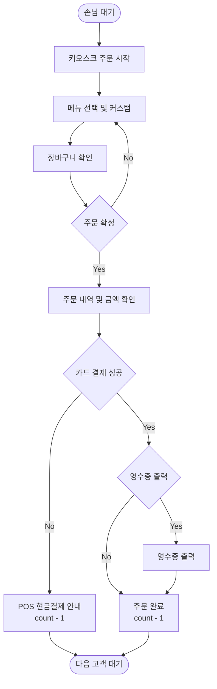

# 카페 키오스크 프로젝트 기획 및 구현 계획서

## 1. 프로젝트 최종 목표

파이썬으로 실행되는 **카페 키오스크 프로그램**을 만든다.

프로그램의 주요 대상은 다음 3가지이다.

1. 손님
2. 점원
3. 키오스크

전체 흐름은 다음과 같다.

```text
손님 입장
→ 주문
→ 결제
→ 주문 확인
→ 제조
→ 상품 수령
→ 손님 퇴장
```

---

## 2. 프로젝트 범위

처음부터 기능을 너무 많이 만들지 않고, 과제 조건과 발표에 필요한 기능을 중심으로 구성한다.

| 구분 | 주요 기능 |
|---|---|
| 손님 | 주문, 카드결제, 현금결제, 상품수령 |
| 점원 | 입점인사, 주문확인, 제조, 청소, 퇴점인사 |
| 키오스크 | 메뉴출력, 주문, 취소, 옵션, 재고확인 |
| 결제 | 카드 / 현금 |
| 상품 | 음료 / 푸드 / MD |
| 추천 | 카테고리별 매출 1위 |
| 기타 | 영수증, 포장/매장, 회원등급 |

---

## 3. 프로그램 전체 구성

프로그램을 크게 6부분으로 나눈다.

```text
1. 사람
2. 상품
3. 주문
4. 결제
5. 키오스크
6. 매장 운영
```

각 부분을 따로 만든 뒤 마지막에 연결한다.



---

## 4. 사람 클래스 구조

사람은 크게 손님과 점원으로 나눈다.

```text
Person
├─ Customer
└─ Staff
```

### Person

공통 정보:

- 이름
- 상태

### Customer

주요 기능:

- 메뉴 보기
- 주문하기
- 결제하기
- 상품 받기
- 퇴점하기

### Staff

주요 기능:

- 입점 인사
- 주문 확인
- 제조
- 상품 전달
- 매장 정리
- 퇴점 인사

---

## 5. 상품 클래스 구조

상품은 하나의 부모 클래스에서 시작한다.

```text
Product
├─ Beverage
├─ Food
└─ MDProduct
```

### Product 공통 정보

- 상품명
- 가격
- 재고
- 판매량
- 매출

---

## 6. 음료

음료 예시:

```text
아메리카노
카페라떼
녹차
초코 블렌디드
```

음료는 추가 옵션을 가진다.

- 사이즈
- 샷 추가
- 시럽 추가
- 휘핑 추가

옵션에 따라 가격이 올라갈 수 있다.

---

## 7. 푸드

푸드는 다음과 같이 구성한다.

```text
샌드위치
빵
```

예시:

```text
햄치즈 샌드위치
치킨 샌드위치
크루아상
소금빵
```

---

## 8. MD 상품

MD는 다음과 같이 구성한다.

```text
텀블러
머그컵
```

예시:

```text
화이트 텀블러
블랙 텀블러
화이트 머그컵
```

---

## 9. 주문 클래스

주문을 관리하는 클래스는 `Order`로 만든다.

Order에 들어갈 정보:

```text
주문번호
주문상품
상품수량
총금액
매장/포장
결제방법
주문상태
```

주문상태 예시:

```text
주문접수
제조중
제조완료
수령완료
```

---

## 10. 결제 클래스 구조

결제는 다음과 같이 구성한다.

```text
Payment
├─ CardPayment
└─ CashPayment
```

### CardPayment

키오스크에서 사용한다.

```text
결제금액 확인
↓
카드결제
↓
성공 / 실패
```

### CashPayment

점원의 POS에서 사용한다.

```text
결제금액 확인
↓
손님이 낸 돈 입력
↓
금액 충분 여부 확인
↓
잔돈 계산
↓
결제 완료
```

---

## 11. 현금결제 오류 처리

`try / except`는 현금 결제에서 사용한다.

### 숫자가 아닌 값을 입력한 경우

```text
결제금액: 8,000원

손님이 낸 돈:
만원
```

이 경우 잘못된 입력으로 처리한다.

### 현금이 부족한 경우

```text
결제금액: 8,000원
받은 돈: 5,000원
```

출력:

```text
금액이 부족합니다.
```

---

## 12. 키오스크 기능

Kiosk 클래스의 주요 기능:

```text
메뉴 보여주기
카테고리 선택
상품 선택
옵션 선택
장바구니 관리
재고 확인
결제
영수증
추천 메뉴
```

키오스크가 모든 기능을 직접 처리하는 것이 아니라, 주문 / 상품 / 결제 클래스를 연결한다.

---

## 13. 메인 메뉴 화면

```text
======================
      CAFE KIOSK
======================

1. 음료
2. 푸드
3. MD
4. 추천 메뉴
5. 장바구니
6. 주문 취소

번호 선택:
```

---

## 14. 음료 메뉴 화면

```text
================
      음료
================

1. 아메리카노
2. 카페라떼
3. 녹차
4. 초코 블렌디드

0. 뒤로가기
```

---

## 15. 음료 옵션 화면

예시:

```text
사이즈를 선택하세요.

1. Small
2. Medium +500원
3. Large +1000원
```

추가 옵션:

```text
1. 샷 추가 +500원
2. 시럽 추가 +500원
3. 추가 없음
```

---

## 16. 장바구니

장바구니는 **List**를 사용한다.

예시:

```text
장바구니

아메리카노 Large
카페라떼 Medium
햄치즈 샌드위치
```

장바구니 기능:

- 상품 확인
- 상품 삭제
- 추가 주문
- 결제 진행
- 주문 전체 취소

---

## 17. Dictionary 사용

메뉴 데이터는 Dictionary로 관리한다.

```text
메뉴

음료
 ├─ 아메리카노
 ├─ 카페라떼
 └─ 녹차

푸드
 ├─ 샌드위치
 └─ 빵

MD
 ├─ 텀블러
 └─ 머그컵
```

기본 구조:

```text
메뉴 =
{
    음료 : [...],
    푸드 : [...],
    MD : [...]
}
```

---

## 18. 재고 관리

모든 상품은 재고를 가진다.

| 상품 | 재고 |
|---|---:|
| 아메리카노 | 10 |
| 카페라떼 | 5 |
| 샌드위치 | 2 |
| 텀블러 | 3 |

주문이 완료되면 재고를 감소시킨다.

```text
샌드위치

재고 2
↓
1개 판매
↓
재고 1
```

재고가 0이면:

```text
SOLD OUT
```

으로 표시하고 주문할 수 없게 한다.

---

## 19. 캡슐화

캡슐화는 **재고 데이터**에 적용한다.

재고를 프로그램의 아무 곳에서나 직접 수정하지 않고 아래 기능을 통해 변경한다.

```text
재고 확인
재고 감소
재고 추가
```

발표 설명:

> 재고가 잘못된 값으로 변경되는 것을 막기 위해 재고 데이터를 보호했습니다.

---

## 20. 추천 메뉴

추천 메뉴는 다음 세 카테고리를 확인한다.

```text
음료
푸드
MD
```

각 카테고리에서 매출이 가장 높은 상품을 찾는다.

예시:

| 상품 | 매출 |
|---|---:|
| 아메리카노 | 50,000 |
| 카페라떼 | 35,000 |
| 녹차 | 20,000 |

추천 음료:

```text
아메리카노
```

최종 추천 화면:

```text
추천 메뉴

음료 BEST
아메리카노

푸드 BEST
햄치즈 샌드위치

MD BEST
화이트 텀블러
```

---

## 21. 회원 등급

회원 기능은 단순하게 구성한다.

```text
일반회원
실버회원
골드회원
```

| 등급 | 할인 |
|---|---:|
| 일반 | 0% |
| 실버 | 5% |
| 골드 | 10% |

제휴카드:

```text
제휴카드 있음 → 추가 할인
제휴카드 없음 → 추가 할인 없음
```

---

## 22. 매장 / 포장 선택

주문 시작 시 선택한다.

```text
이용 방법을 선택하세요.

1. 매장
2. 포장
```

선택 결과는 Order에 저장한다.

---

## 23. 영수증

결제 완료 후 영수증 출력 여부를 묻는다.

```text
영수증을 출력하시겠습니까?

1. 예
2. 아니오
```

영수증 항목:

```text
주문번호
상품
수량
가격
할인
최종금액
결제방법
```

---

## 24. while문 사용 위치

프로그램 전체 운영에 `while`문을 사용한다.

```text
매장 운영 시작
↓
손님이 있는지 확인
↓
손님 있음 → 주문 실행
손님 없음 → 점원 청소
↓
다시 손님 확인
```

한 번 주문 후 프로그램이 끝나는 것이 아니라 계속 반복되도록 한다.

---

## 25. 점원 행동 흐름

```text
손님 방문
↓
입점 인사
↓
주문 확인
↓
현금결제라면 POS 주문 처리
↓
제조 시작
↓
대기시간 약 4분 안내
↓
상품 전달
↓
퇴점 인사
```

손님이 없다면:

```text
주변 정리
또는
매장 청소
```

---

## 26. 손님 행동 흐름

```text
매장 방문
↓
결제 방식 선택
↓
카드 / 현금
```

### 카드

```text
키오스크
↓
메뉴
↓
상품
↓
옵션
↓
장바구니
↓
카드결제
```

### 현금

```text
점원
↓
POS 주문
↓
현금결제
↓
잔돈 수령
```

이후 공통 흐름:

```text
주문 완료
↓
약 4분 대기
↓
상품 수령
↓
퇴점
```

---

## 27. 클래스 밖 함수 계획

과제 조건에 맞춰 최소 5개 이상 만든다.

| 함수 | 역할 |
|---|---|
| `show_main_menu` | 처음 메뉴 출력 |
| `select_category` | 음료/푸드/MD 선택 |
| `calculate_total` | 총금액 계산 |
| `calculate_change` | 잔돈 계산 |
| `show_receipt` | 영수증 출력 |
| `show_waiting_time` | 대기시간 안내 |
| `check_customer` | 손님 존재 여부 확인 |

---

## 28. `__init__` 사용 계획

다음 클래스에 `__init__`을 적용한다.

```text
Person
Product
Order
Payment
Kiosk
```

---

## 29. `__str__` 사용 계획

최소 두 곳에 사용한다.

추천:

```text
Product
Order
```

Product 출력 예시:

```text
아메리카노 / 4,500원 / 재고 5
```

Order 출력 예시:

```text
주문번호 3 / 총금액 12,500원 / 카드결제
```

---

## 30. 실제 구현 순서

### 1단계. 상품

```text
Product
Beverage
Food
MDProduct
```

### 2단계. 사람

```text
Person
Customer
Staff
```

### 3단계. 메뉴 데이터

```text
음료
푸드
MD
```

### 4단계. 주문

```text
Order
장바구니
총금액
```

### 5단계. 키오스크

```text
메뉴 출력
선택
옵션
재고
```

### 6단계. 결제

```text
Payment
CardPayment
CashPayment
```

### 7단계. 오류 처리

```text
잘못된 메뉴 번호
숫자가 아닌 값
현금 부족
재고 부족
```

### 8단계. 추천 메뉴

```text
매출 기록
매출 비교
BEST 선정
```

### 9단계. 점원 기능

```text
인사
제조
전달
청소
```

### 10단계. 전체 연결

```text
while
↓
손님 방문
↓
주문
↓
결제
↓
제조
↓
수령
↓
퇴점
↓
다음 손님
```

---

## 31. 테스트 계획

### 정상 주문 테스트

```text
아메리카노 선택
→ 옵션 선택
→ 카드결제
→ 주문 완료
```

### 재고 테스트

```text
재고 0 상품 선택
→ SOLD OUT
```

### 현금 부족 테스트

```text
결제금액 10,000원
받은돈 5,000원
→ 금액 부족
```

### 잘못된 입력 테스트

```text
메뉴 선택:
ABC

→ 숫자를 입력해주세요.
```

### 장바구니 테스트

```text
상품 추가
→ 삭제
→ 다른 상품 추가
→ 결제
```

### 추천 메뉴 테스트

```text
상품 여러 번 판매
↓
매출 증가
↓
BEST 상품 변경 확인
```

---

## 32. 발표 순서

### 1. 주제 설명

카페에서 사용하는 키오스크 시스템을 파이썬 객체지향 방식으로 구현한다.

### 2. 프로그램 사용자

```text
손님
점원
키오스크
```

### 3. 전체 흐름

```text
입장
→ 주문
→ 결제
→ 제조
→ 수령
→ 퇴장
```

### 4. 클래스 설명

```text
Person
Product
Payment
```

및 상속 구조 설명.

### 5. 리스트와 딕셔너리

```text
List → 장바구니
Dictionary → 메뉴
```

### 6. 캡슐화

```text
재고 보호
```

### 7. 오류 처리

```text
현금 부족
잘못된 입력
```

### 8. while문

```text
손님이 계속 방문할 수 있도록 프로그램 반복
```

### 9. 추천 메뉴

```text
매출 기준 자동 선정
```

### 10. 실행 시연

주문 하나를 처음부터 끝까지 실행하여 보여준다.

---

## 33. 전체 프로젝트 뼈대

```text
Cafe Kiosk Program

├── Person
│   ├── Customer
│   └── Staff
│
├── Product
│   ├── Beverage
│   ├── Food
│   └── MDProduct
│
├── Payment
│   ├── CardPayment
│   └── CashPayment
│
├── Order
│
├── Kiosk
│
├── Menu Dictionary
│
├── Cart List
│
├── Recommendation
│
├── Inventory
│
├── Receipt
│
└── Main while
```

---

## 34. 전체 개발 진행 기준

```text
기능 확정
↓
클래스 확정
↓
데이터 확정
↓
실행 순서 확정
↓
오류 상황 확정
↓
실제 코딩
↓
테스트
↓
발표 준비
```

이 문서는 실제 Python 코드를 작성하기 전, 전체 구조와 구현 순서를 정하기 위한 설계 문서로 사용한다.

## 현재 코드 구조와 실행

- `src/main.py`: 키오스크를 불러와 실행하는 진입점
- `src/kiosk.py`: 상품 선택, 장바구니, 결제 흐름
- `src/menu.py`: 상품 클래스와 메뉴 클래스
- `src/menu_data.py`: 처음 표시할 상품명, 가격, 재고 데이터
- `src/order.py`: 장바구니 항목과 주문
- `src/payment.py`: 카드·현금 결제
- `src/receipt.py`: 영수증과 대기시간 안내
- `src/person.py`: 손님과 점원

프로젝트 루트에서 `python src/main.py` 또는 `python -m src.main`으로 실행한다.
음료는 사이즈와 샷·시럽 옵션, 푸드는 워밍/노워밍 옵션을 선택한다.
MD 상품에는 추가 옵션이 없다.
재고는 `Product.__stock`에 보관하고 `stock` 조회, `sell`, `restock`으로만 접근한다.
